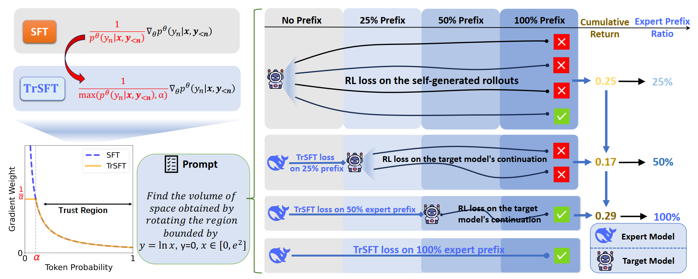
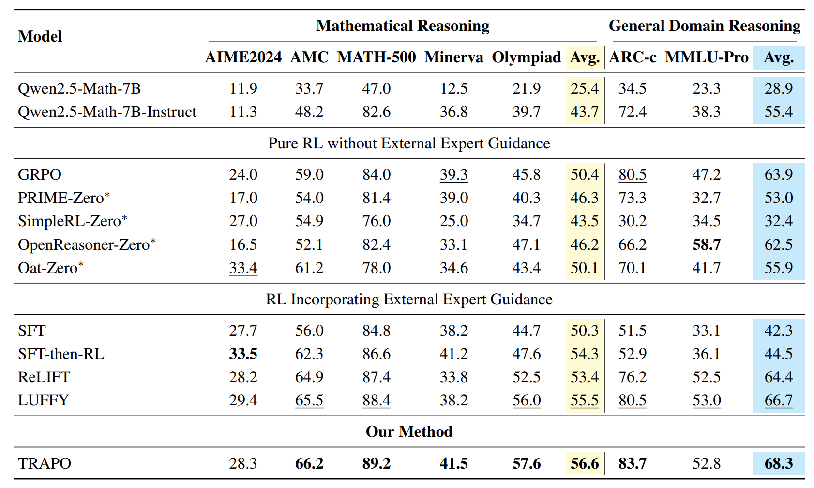

# 📘 TRAPO: Trust-Region Adaptive Policy Optimization

> **TRAPO: A Unified Post-Training Framework for Reasoning-Enhanced Large Language Models**
> Published at **ICLR 2026**

## 📄 Paper

[](https://arxiv.org/pdf/2512.17636v1)
[](https://openreview.net/forum?id=oXlSEcxD6N)

---

## 🚀 Overview

**TRAPO (Trust-Region Adaptive Policy Optimization)** is a unified post-training framework that tightly integrates **Supervised Fine-Tuning (SFT)** and **Reinforcement Learning (RL)** for improving reasoning capabilities in Large Language Models (LLMs).

Unlike conventional two-stage pipelines (SFT → RL), TRAPO adopts a learn-while-practicing paradigm, interleaving expert supervision and policy exploration within each training instance.
<div align="center">  </div> <p align="center"> <b>Figure:</b> Overview of TRAPO. The framework combines Trust-Region SFT (TrSFT) with adaptive expert-prefix guidance to enable stable and efficient reasoning-oriented post-training. </p>

---

## 🔥 Key Ideas

### 1️⃣ Trust-Region SFT (TrSFT)

Standard SFT may introduce unstable updates due to large gradients on low-probability expert tokens.

TRAPO proposes **Trust-Region SFT**, which:

* performs standard imitation **inside a trust region**
* attenuates optimization outside the region
* shifts behavior from **mode-covering → mode-seeking**

This stabilizes joint SFT + RL training.

---

### 2️⃣ Adaptive Expert Guidance

TRAPO dynamically determines:

> *How much expert guidance should be used for each problem.*

Instead of fixed demonstrations, TRAPO:

* starts with pure RL exploration
* increases expert prefix length only when needed
* balances exploration and supervision automatically

---

### 3️⃣ Micro-Group Sampling

Each prompt is trained through progressively guided rollouts:

```
No guidance → Partial prefix → Full expert trajectory
```

This enables efficient reasoning skill internalization while maintaining diversity.

---

## 📊 Results

TRAPO achieves consistent improvements across multiple mathematical and general reasoning benchmarks, outperforming standalone SFT, pure RL methods, and prior hybrid approaches.
<div align="center">  </div> <p align="center"> <b>Figure:</b> Performance comparison on reasoning benchmarks. TRAPO surpasses existing post-training paradigms, demonstrating improved reasoning accuracy and generalization. </p>

---

## ⚙️ Installation

```bash
conda create -n trapo python=3.10
conda activate trapo
https://github.com/Su-my/TRAPO.git
cd luffy
pip install -r requirements.txt
pip install -e .
cd verl
pip install -e .
```

---

## 🏋️ Training

Example training command:

```bash
bash exp_scripts/train_trapo.sh
```

---

## 📈 Evaluation

```bash
bash eval.sh
```

---

## 🙏 Acknowledgements

This work builds upon a growing line of research exploring the integration of supervised learning and reinforcement learning for reasoning-enhanced LLMs.

In particular, we gratefully acknowledge the **LUFFY framework**
([GitHub](https://github.com/ElliottYan/LUFFY)), which introduces
off-policy expert trajectory integration into reinforcement learning
and demonstrates the effectiveness of expert-guided policy optimization.
TRAPO further extends this direction by enabling *instance-level adaptive
guidance* and proposing a theoretically grounded trust-region formulation
for stable SFT–RL unification.

We also thank the open-source community and prior work on RL-based reasoning systems including GRPO, ReLIFT, OpenReasoner, and related post-training frameworks.

---

## 📚 Citation

```bibtex
@inproceedings{
su2026trustregion,
title={Trust-Region Adaptive Policy Optimization},
author={Mingyu Su and Jian Guan and Yuxian Gu and Minlie Huang and Hongning Wang},
booktitle={The Fourteenth International Conference on Learning Representations},
year={2026},
url={https://openreview.net/forum?id=oXlSEcxD6N}
}
```
